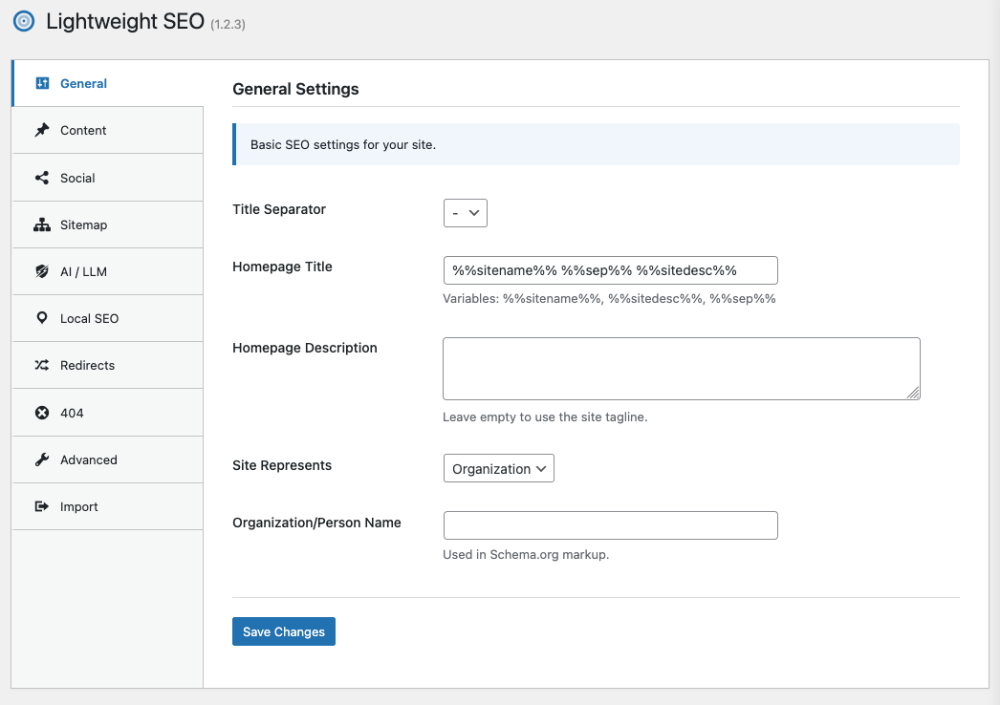

# Lightweight SEO

Lightweight SEO plugin for WordPress - minimal footprint, maximum impact.

[](https://github.com/lwplugins/lw-seo/actions/workflows/ci.yml)

**Website:** [lwplugins.com](https://lwplugins.com)
**GitHub:** [github.com/lwplugins/lw-seo](https://github.com/lwplugins/lw-seo)



## Features

### Meta Tags & Titles
- **Custom Titles** - Per-post/page title override with template variables
- **Meta Descriptions** - Auto-generated from the excerpt (through `get_the_excerpt()`, so membership/paywall plugins can mask it), filterable via `lw_seo_meta_description`
- **Title Separator** - Customizable separator character
- **Canonical URLs** - One self-referencing canonical per page (also on `/page/2/` of archives), filterable via `lw_seo_canonical_url`
- **Robots Control** - noindex/nofollow per post

### Social Media
- **Open Graph** - Facebook, LinkedIn sharing optimization
- **Twitter Cards** - Summary and large image cards
- **Default Social Image** - Fallback when post has no featured image
- **Custom OG Images** - Per-post social images

### XML Sitemap
- **Auto-generated** - Posts, pages, categories, tags and WooCommerce products
- **Custom Post Types** - Every public CPT (ACF, CPT UI, …) is included automatically, with a per-type toggle
- **Custom Taxonomies** - Opt-in, per taxonomy
- **Clean** - noindex types/taxonomies, noindex and password-protected posts, and the WooCommerce cart/checkout/my account pages are left out
- **Developer filters** - `lw_seo_sitemap_post_types`, `lw_seo_sitemap_exclude_post`, `lw_seo_sitemap_excluded_ids`, `lw_seo_sitemap_urls`
- Available at `yoursite.com/sitemap.xml` (per-type files: `sitemap-{type}.xml`)

### Schema.org / JSON-LD
- **WebSite Schema** - Site-wide structured data
- **Article Schema** - Blog posts with author info
- **Organization/Person** - Knowledge graph support
- **Breadcrumb Schema** - Navigation markup

### Breadcrumbs
- **Shortcode** - `[lw_breadcrumbs]`
- **PHP Function** - `\LightweightPlugins\SEO\lw_seo_breadcrumbs()`
- **Microdata** - Built-in structured data

### FAQ Block
- **Gutenberg block** - `lw-seo/faq` with FAQPage schema

### AI & LLM
- **llms.txt** - Spec-compliant ([llmstxt.org](https://llmstxt.org/)) file listing every page and custom post type in its own section, with SEO descriptions, custom summary/intro, an Optional links section and a per-section limit; cached and built as an anonymous visitor
- **llms-full.txt** - Optional full-content Markdown dump (1 MiB cap)
- **Markdown endpoint** - Every post, page, product and term as Markdown at `/md` or `/markdown` (or `?format=md`, or `Accept: text/markdown`), with YAML frontmatter, `Vary: Accept` on negotiated responses and discovery links (`rel="alternate"` / `rel="describedby"`)
- **Content Signals** - Three-state `search` / `ai-input` / `ai-train` signals ([Cloudflare Content Signals Policy](https://blog.cloudflare.com/content-signals-policy/)) sent as a `Content-Signal` header, meta tag and robots.txt line; per-post and per-term overrides
- **AI Crawler Control** - 22 verified crawlers grouped by purpose, blockable one by one or per purpose (training / AI search / user-triggered): OpenAI (GPTBot, OAI-SearchBot, ChatGPT-User), Anthropic (ClaudeBot, Claude-SearchBot, Claude-User), Google-Extended, Applebot-Extended, Perplexity, Meta, Amazon, Mistral AI, Common Crawl, AI2, ByteDance
- **robots.txt** - Adds the sitemap, AI crawler rules and Content-Signal line through WordPress's `robots_txt` filter (compatible with other plugins); preview and physical-file warning in the admin

### WooCommerce Integration
- **Auto-Detection** - Automatically enables when WooCommerce is active
- **Product OpenGraph** - Price, currency, availability, brand, condition
- **Shop Title** - Title template for the shop page (product archive)
- **Product Schema** - Full Schema.org Product markup with offers
- **Reviews Schema** - Product reviews and aggregate ratings
- **Product Sitemap** - Include products and product categories
- **Custom Settings** - Dedicated WooCommerce SEO settings tab

### Local SEO
- **LocalBusiness Schema** - 100+ business types supported
- **Business Address** - Street, city, state, zip, country
- **Contact Info** - Phone, email with schema markup
- **Opening Hours** - Per-day hours with OpeningHoursSpecification
- **Geo Coordinates** - Latitude/longitude for location
- **Shortcodes** - `[lw_address]`, `[lw_phone]`, `[lw_email]`, `[lw_hours]`, `[lw_map]`

### Redirects & 404
- **Redirect Manager** - 301, 302, 307, 410 and 451 redirects, with CSV import/export
- **404 to homepage** - Optional redirect of 404s to the homepage, as a last resort after your redirect rules and WordPress's own redirects (renamed slugs, guessed URLs)

### Migration
- **Import from Rank Math and Yoast SEO** - Options, post and term meta, primary categories and redirects (admin Import tab or `wp lw-seo migrate`)

### Cleanup
- Remove shortlinks
- Remove RSD links
- Remove WLW manifest

### Admin Interface
- Unified **LW Plugins** menu
- Modern tabbed settings interface
- WordPress media library integration
- Translations: Hungarian (hu_HU) included

### Developer & Automation
- **WP-CLI** - `wp lw-seo option|sitemap|llms|robots|crawlers|redirect|migrate …` — every setting can be read and set (validated) from the command line, see [docs/cli.md](docs/cli.md)
- **REST API** - Read-only `lw-seo/v1` endpoints for headless setups, see [docs/rest-api.md](docs/rest-api.md)
- **LW Site Manager abilities** - `lw-seo/get-meta`, `set-meta`, `get-content-signals`, `get-markdown`, `get-options` (per-object permission checks), see [docs/site-manager-abilities.md](docs/site-manager-abilities.md)
- **Hooks** - see [docs/developers.md](docs/developers.md)

## Installation

### Via Composer (recommended)

```bash
composer require lwplugins/lw-seo
```

### Manual Installation

1. Download the latest release
2. Upload to `/wp-content/plugins/lw-seo/`
3. Activate in WordPress admin
4. Go to **LW Plugins → SEO**

## Template Variables

Use these in title templates:

| Variable | Description |
|----------|-------------|
| `%%sitename%%` | Site name |
| `%%sitedesc%%` | Site tagline |
| `%%title%%` | Post/page title |
| `%%sep%%` | Separator character |
| `%%excerpt%%` | Post excerpt |
| `%%author%%` | Author name |
| `%%date%%` | Publish date |
| `%%modified%%` | Last modified date |
| `%%category%%` | Primary category |
| `%%tag%%` | Tags |
| `%%term_title%%` | Taxonomy term name |
| `%%term_description%%` | Taxonomy term description |
| `%%currentdate%%` | Current date |
| `%%currentmonth%%` | Current month |
| `%%currentyear%%` | Current year |
| `%%page%%` / `%%pagenumber%%` | Page number |
| `%%searchphrase%%` | Search query |

Full reference: [docs/template-variables.md](docs/template-variables.md)

## Requirements

- PHP 8.2+
- WordPress 6.6+

## Conflict Detection

LW SEO skips its head meta output (and shows a notice on its settings page) when detecting:
- Yoast SEO
- Rank Math
- All in One SEO

## Development

```bash
# Install dependencies
composer install

# Run code sniffer
composer phpcs

# Fix coding standards
composer phpcbf

# Static analysis (PHPStan level 5)
composer analyse

# Run tests
composer test
```

Full documentation: [docs/](docs/README.md) · Changelog: [CHANGELOG.md](CHANGELOG.md)

## License

GPL-2.0-or-later


## Sponsor

<a href="https://sinann.io/">
  
</a>

Supported by [Sinann](https://sinann.io/)
